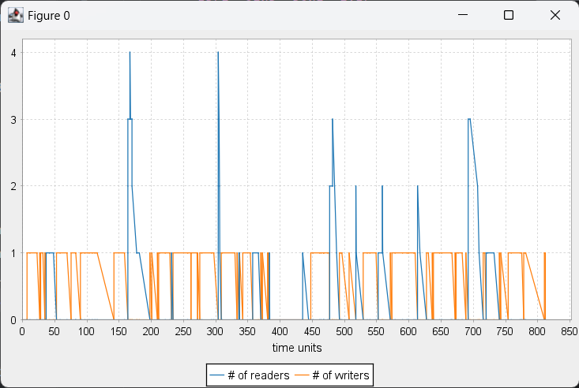
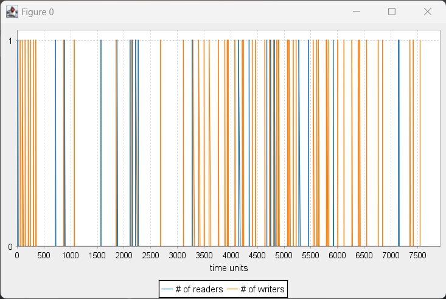

# Stochastic modelling

## Task 1: Simulator

In the file <tt>u07.modelling.CTMCSimulation</tt> are defined the extensions methods that allow to perform statistical
analysis over simulations. In particular, three methods have been defined: <tt>meanTimeToReachS(s: S)</tt>, 
<tt>meanRelativeTimeWhile(f: S => Boolean)</tt>, and <tt>ratioOfSimulationSatisfying(cond: SimulationResult\[S] => Boolean)</tt>.

These methods are callable on Lists of <tt>SimulationResult</tt>, where a SimulationResult is a list of <tt>Events</tt>.
Doing so is possible to evaluate the generic performance of the system reducing the statistical error.
It is possible to generate a list of simulation results by calling the method <tt>simulateNTimes<tt> which has two different versions
based on the stop condition of the single runs:

- <tt>simulateNTimes(s0: S, rnd: Random)(depth: Int)(n: Int)</tt>
- <tt>simulateNTimes(s0: S, rnd: Random)(stopCondition: Event\[S] => Boolean)(n: Int)</tt>

Some statistical analysis executed over the preexisting <tt>stocChannel</tt> system, gave the following results:

- average time to reach the DONE state: 1.257 time units
- average time passed in the state FAIL: 4.654924356142159E-6%
- ratio of simulation that didn't fail: 0.67%

## Task 2: Guru

In order to perform the required statistical analysis, the methods described in the previous task description have been
used, proving so the reusability of those methods.

The evaluation of the system has been done using 10 processes (initial state = IDLE).

|   | k SELECT -> READING | k SELECT -> WRITING | % of time in READING | % of time in WRITING |
|---|---------------------|---------------------|----------------------|----------------------|
|   | 100.000             | 400.000             | 25.7%                | 72.2%                |
|   | 100.000             | 300.000             | 39.0%                | 59.3%                |
|   | 100.000             | 200.000             | 41.4%                | 56.6%                |
|   | 100.000             | 100.000             | 53.0%                | 42.3%                |
|   | 200.000             | 100.000             | 62.8%                | 31.6%                |
|   | 300.000             | 100.000             | 83.0%                | 11.8%                |
|   | 400.000             | 100.000             | 89.0%                | 6.2%                 |  

We can notice that the time in which nobody is reading or writing is really low. This is due to the high transition rate
of the transition IDLE -> SELECT. By reducing this value, we increase the time that a process need to wait before reading
or writing.

Readers and writers with the transition rate IDLE -> SELECT equals to 1



Readers and writers with the transition rate IDLE -> SELECT equals to 0.01



## Task 3: Chemist

I implemented the Chemist, defining it as follow:

```
val chemist = SPN[Place](
    Trn(MSet(A), m => 1.0, MSet(X), MSet()),
    Trn(MSet(X, X, Y), m => 1.0, MSet(X, X, X), MSet()),
    Trn(MSet(B, X), m => 1.0, MSet(Y, D), MSet()),
    Trn(MSet(X), m => 1.0, MSet(E), MSet()),
)
```

However, I didn't manage to replicate the chemist result and I didn't obtain a graph that oscillates since I didn't 
find the good values to use for the transition rate constants.

## Additional work

Testing the chemist system required to use large number of tokens but the basic implementation of MSet seemed to lack of
efficiency due to its internal behaviour based on list, therefore I refactored the <tt>union</tt>, <tt>diff</tt>, <tt>disjoined</tt>, 
and <tt>toString</tt> methods so that they work directly with maps.

```
extension [A](self: Map[A, Int])
  def union(m: Map[A, Int]): Map[A, Int] =
    (self.keySet ++ m.keySet).foldLeft(Map.empty[A, Int])((acc, k) => acc + (k -> (m.getOrElse(k, 0) + self.getOrElse(k, 0))))

  def diff(m: Map[A, Int]): Map[A, Int] =
    (self.keySet).foldLeft(Map.empty[A, Int])((acc, k) => acc + (k -> Math.max(0, self.getOrElse(k, 0) - m.getOrElse(k, 0))))

  def disjoined(m: Map[A, Int]): Boolean =
    (self.filter((k, n) => n > 0).keys.toSeq intersect m.filter((k, n) => n > 0).keys.toSeq).isEmpty
```

I also made the <tt>toList</tt> internal constant lazy because also that was source of inefficiency.